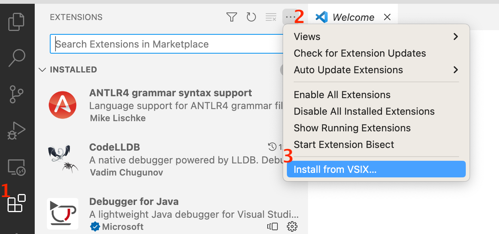

# smol README

This extension provides language support for SMOL (<https://smolang.org>), an
imperative, object-oriented research language. SMOL integrates semantic web
technologies and [numerical simulation blocks](https://fmi-standard.org), and
can serve as a test bed for creating digital twins.

## Features

This extension provides syntax highlighting, and a command to run a SMOL REPL
inside VS Code.

## Extension Settings

This extension contributes the following settings:

- `smol.smolJarPath`: The path to `smol.jar`.

## Release Notes

### 0.0.1

- Initial release

## Installation

To install the latest released version:

1. download the `.vsix` file from
   https://github.com/smolang/smol-vs-code/releases/latest
2. open the Extensions list and choose "Install from VSIX..." from the menu:

   <picture>
   
   </picture>

3. Choose the file downloaded in Step 1

### Running an unreleased version

To use the extension from a git checkout, copy this directory into your
`~/.vscode/extensions` directory, e.g., with the following commands:

    cd ~/.vscode/extensions
    cp -r /path/to/smol-vs-code smol

## Development

First, install [node](https://nodejs.org/en) then run `npm install` to install
the required dependencies.

To run the current source, open the project folder inside VS Code and press
`F5` (Run -> Start Debugging).

To create a `.vsix` package, run `vsce package`.

